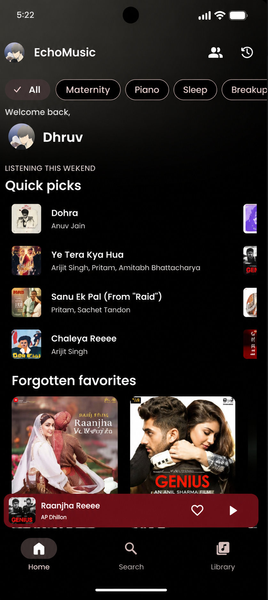

# 🎵 Rhytma

### A modern open-source music experience for Android.

**Stream • Discover • Import • Listen**

[Download Rhytma v1.0.0](https://github.com/archive97off-gif/Rhytma-/releases/tag/v1.0.0)

---

## ✨ About Rhytma

**Rhytma** is a modified open-source Android music application focused on a clean listening experience, playlist management, music discovery, and easy playlist importing.

Rhytma is developed and modified by **Dhruv Homkar** and is based on the open-source **Echo Music** project, which itself builds upon **SimpMusic**.

---

## 📱 Screenshots

  
  
  
  
  

---

## 🚀 Features

- 🎧 High-quality music streaming
- 🔎 Music search and discovery
- 🎼 Synced lyrics
- 📚 Local playlist management
- 📥 Spotify playlist importing
- 🇮🇳 JioSaavn playlist importing
- 🎬 Video playback support
- 🤖 AI-based song suggestions
- 🎨 Light, Dark and dynamic themes
- 🔀 Crossfade and gapless playback
- ⏱️ Sleep timer
- 🚗 Android Auto support
- 🖼️ Spotify Canvas support
- 💾 Local caching and playback features

---

## 🔄 Playlist Importing

### JioSaavn

Rhytma can import supported public JioSaavn playlists.

Paste a supported playlist/share link into the importer and Rhytma retrieves the playlist metadata, matches the songs using its existing music search system, and creates a local Rhytma playlist.

### Spotify

Rhytma also contains Spotify playlist importing functionality.

Spotify integration uses Spotify authentication where required. Availability can depend on Spotify's API access and account restrictions.

Rhytma does **not** extract Spotify audio or bypass Spotify authentication/DRM.

---

## 📥 Installation

### Universal APK — Recommended

The Universal build is the easiest option for most users.

### ARM64 APK

A smaller ARM64 build is also provided for compatible modern Android devices.

### Download

➡️ **[Download Rhytma v1.0.0](https://github.com/archive97off-gif/Rhytma-/releases/tag/v1.0.0)**

Download the APK from **Assets**, install it on your Android device, and launch Rhytma.

---

## 🏗️ Architecture

Rhytma uses a modern Android/Kotlin Multiplatform architecture.

- **Kotlin Multiplatform (KMP)** — shared core logic and services
- **Jetpack Compose** — modern declarative Android UI
- **AndroidX Media3 / ExoPlayer** — media playback
- **Koin** — dependency injection
- **Room Database** — local structured data
- **DataStore** — application preferences
- **Modular Architecture** — separate data, domain, media and service modules

The shared core is maintained separately in:

**[Rhytma Core](https://github.com/archive97off-gif/Rhytma-core)**

---

## 🛠️ Rhytma Modifications

Rhytma includes modifications and additions made by **Dhruv Homkar**, including work on:

- Rhytma branding
- Spotify playlist importing
- Spotify OAuth/PKCE integration
- Spotify playlist pagination handling
- JioSaavn playlist importing
- Playlist metadata matching
- Local playlist creation and saving
- Importer UI and workflow improvements
- Additional fixes and application changes

---

## 👨‍💻 Developer

**Dhruv Homkar**

GitHub: **[@archive97off-gif](https://github.com/archive97off-gif)**

> Rhytma is a modified open-source project and includes work from its upstream projects and contributors.

---

## ❤️ Acknowledgements

Rhytma would not exist without the open-source projects it is based upon.

Special thanks to:

- **Echo Music** — developed by Aditya (`@iad1tya`)
- **SimpMusic** and its contributors
- All upstream open-source contributors whose work remains part of Rhytma

Original authorship and copyright notices remain applicable to their respective contributions.

---

## ⚖️ License

Rhytma is distributed under the **GNU General Public License v3.0 (GPL-3.0)** in accordance with the licensing requirements of the upstream project.

See the [`LICENSE`](LICENSE) file for full license information.

---

### 🎵 Rhytma

**Modified & maintained by Dhruv Homkar**

Made possible by open source ❤️

